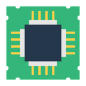
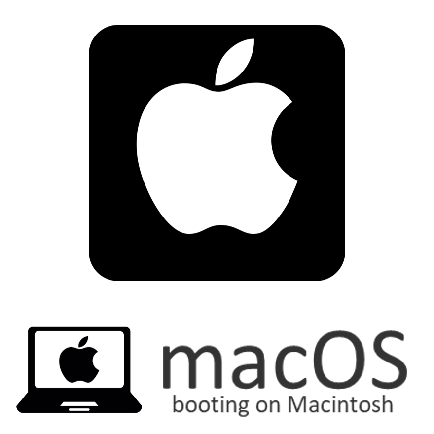

# showing

## mouse
mouse|
--|--

## arrow
left|right
--|--
|

## func
about|bootorder|csr rotate|exit|firmware|hidden|install|reboot|shutdown
--|--|--|--|--|--|--|--|--
||||||||
| || | | | | | |

## tool
apple recovery|netboot|gptsync|memtest|shell
--|--|--|--|--
||||

windows recovery|fwupdate|part|rescue|mok tool
--|--|--|--|--
||||

## vol
firmware|internal|external|optical|netboot|transparent
--|--|--|--|--|--
|||||

## os
### Some Menuentries of rEFInd
Legacy|UEFI|Linux|Unknown
--|--|--|--
|||

### Top 10 of DistroWatch
Rank|Distribution|Icon
--|--|--
1|MX Linux|
2|EndeavourOS|
3|Mint|
4|Manjaro|
5|Fedora|
6|Pop!_OS|
7|Ubuntu|
8|Debian|
9|Lite|
X|openSUSE|

### Remaining
macOS|deepin|fydeOS|android
--|--|--|--
|||

## Ventoy
Ventoy|
--|--