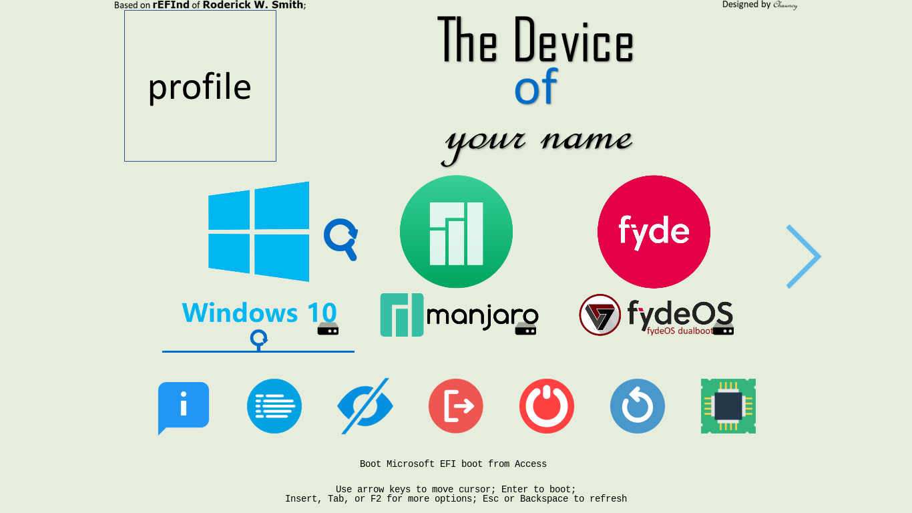
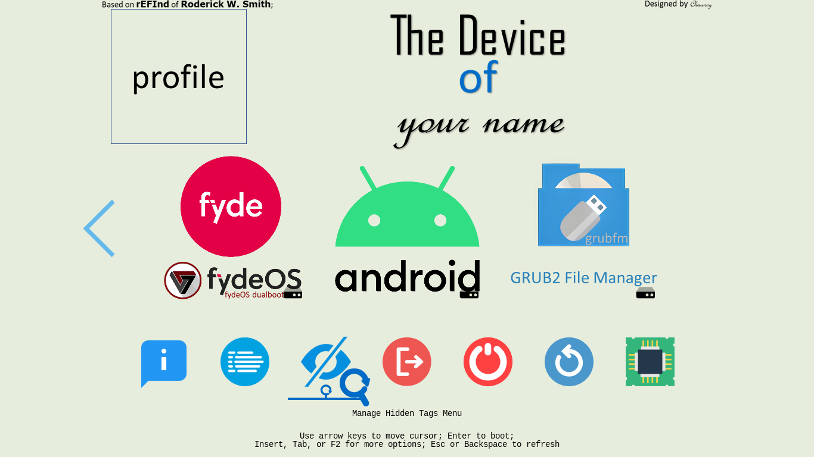
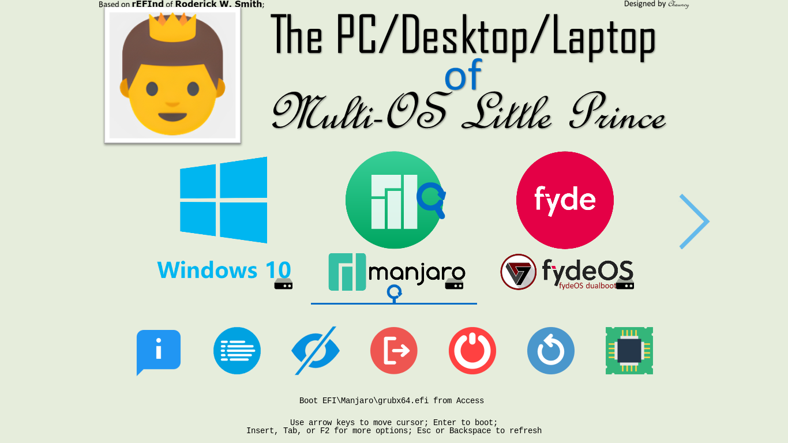
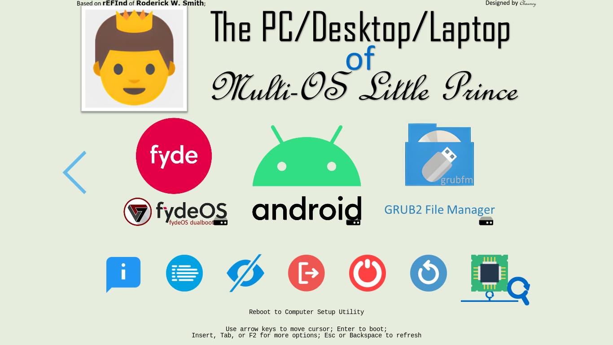
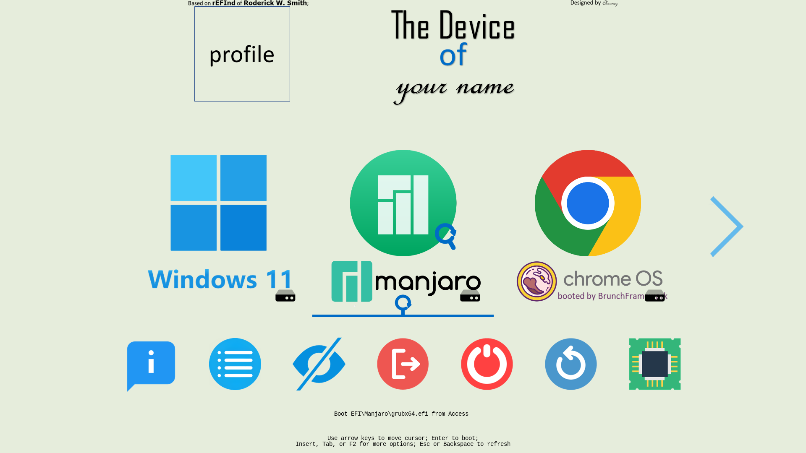
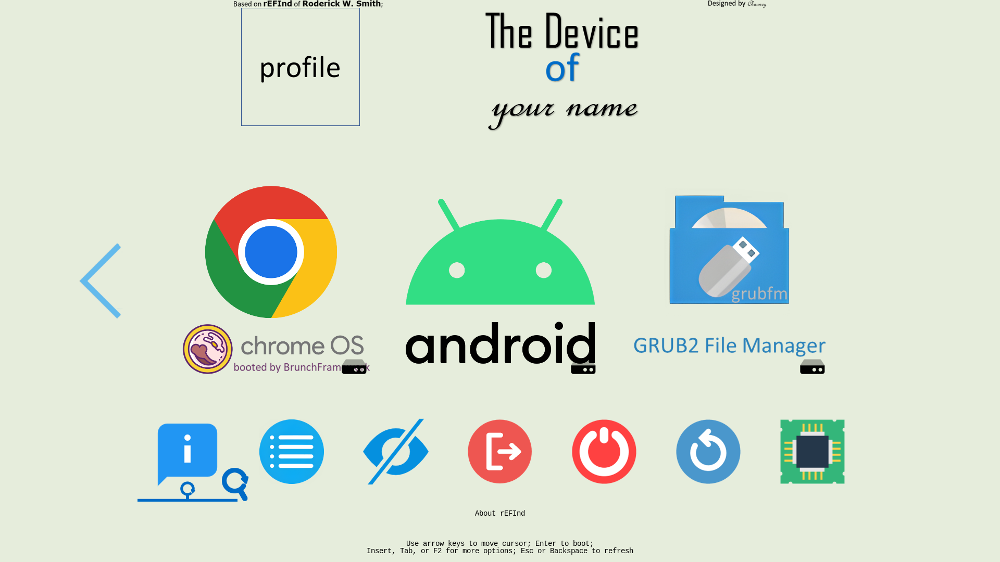
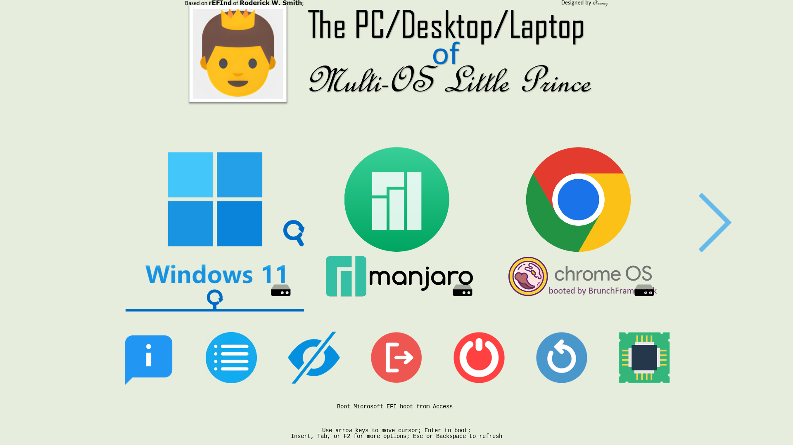
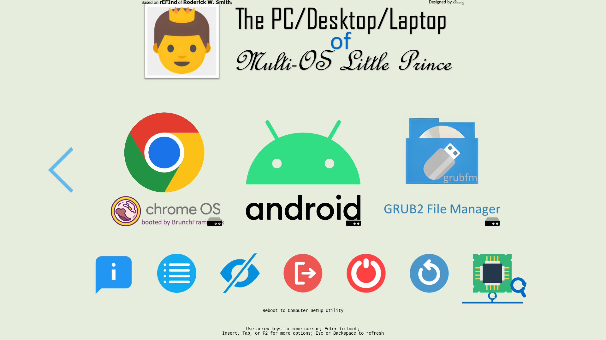

[English](README.md)|[简体中文](自述文件.md)|[繁體中文](繁體中文.md)|...
--|--|--|--

# Yours
Y-o-u-r-s, 
Your own usual rEFInd's sign.
- 你可以
 - ✏️自定義 ***用戶頭像*** ；
 - ✏️自定義 ***設備名稱*** ；
 - ✏️自定義 ***機主姓名*** 。

- 基於 *Roderick W. Smith* 的 [rEFInd Boot Manager](http://www.rodsbooks.com/refind/)，嵌套 [a1ive](https://github.com/a1ive) 的 [grub2-filemanager](https://github.com/a1ive/grub2-filemanager)。

- - 所以你可以借助 [grub2-filemanager](https://github.com/a1ive/grub2-filemanager) 來啟動存儲在內置固態硬盤中的 .iso 文件。

- 為你準備了許多圖標，[icons](https://github.com/M-L-P/icons)。

## 💻️預覽👀
按下鍵盤的 `F10` 或 `\` 可以截屏。 
截圖已折疊。

🖱️點擊展開查看🖱️

## 🧭指南⬇️

### 下載點

🖱️點擊展開查看🖱️

#### 若是 UEFI Firmware
如果你的設備滿足條件，
- 支持 64位的 UEFI；
- GPU/vBIOS 支持 UEFI；

你應該使用 [Yours-UEFI](https://github.com/M-L-P/Yours-UEFI)。

#### 若是 Legacy BIOS
除非你的設備滿足以下情況中的一種，
- 不支持 64位的 UEFI，
- - 支持 32位的 UEFI；
- - 僅支持 Legacy BIOS ，不支持 UEFI；
- GPU/vBIOS 不支持 UEFI；(如下圖)

你應該使用 [Yours-LegacyBIOS](https://github.com/M-L-P/Yours-LegacyBIOS)。

#### 若是 Hyper-V
從 [Releases](https://github.com/M-L-P/Yours/releases)下載 .vhdx。

### 編輯你的橫幅

🖱️點擊展開查看🖱️

- 用 Microsoft PowerPoint 2021+ 打開 `EFI\Yours\Settings\display\BannerEditor.pptx` ；
- 編輯並且自定義你的 頭像、設備名稱 和 姓名或昵稱；
- 另存為 PNG；
- 編輯 `EFI\Yours\Settings\display\display.conf` 用以設置顯示新生成的橫幅；

 

## 📝FAQ❓️
常見問題

### 調整圖標尺寸

🖱️點擊展開查看🖱️

- 編輯 `EFI\Yours\Settings\display\display.conf`

圖標尺寸|令牌|屏幕分辨率|例子
--|--|--|--
原始尺寸|`small_icon_size 48` `big_icon_size 128`|分辨率 < `1024x768`|`800x600` 等
二級尺寸|`small_icon_size 96` `big_icon_size 256`|`1024x768` ≤ 分辨率 < `1920x1080`|`1024x768`、`1366x768`、`1440x900` 等
三級尺寸|`small_icon_size 144` `big_icon_size 384`|分辨率 ≥ `1920x1080`|`1080P`、`2K`、`4K` 等

### Windows 的圖標

🖱️點擊展開查看🖱️

無論你使用哪個版本， 
你應該設置它的圖標 
從 `EFI\Yours\Settings\icon\Windows` 中復製到 `EFI\Yours\Settings\icon\showing`， 
並且重命名為 `os_win8.png`. 
因為 rEFInd 把 `os_win8.png` 當作 `Windows Boot Manager` 的默認圖標。 

### 黑果 的圖標

🖱️點擊展開查看🖱️

為了讓圖形界面銜接得更加緊密，中途沒有代碼界面， 
你應該執行以下步驟。

#### 若是 OpenCore
- 編輯 `config.plist` 設置 `LauncherOption=System` ；
- 剪切 EFI 相關文件，粘貼到 `EFI\Yours\efi\OC` ；
- 編輯 `refind.conf` ，刪除 位於`include /EFI/Yours/Settings/menuentry/examples/OpenCore.conf` 前面的 `#`；

#### 若是 CloverBootloader
- 剪切 EFI 相關文件，粘貼到 `EFI\Yours\efi\CLOVER` ；
- 編輯 `refind.conf` ，刪除 位於 `include /EFI/Yours/Settings/menuentry/examples/CLOVER.conf` 前面的 `#`；

### Linux 發行版的圖標
為你準備了許多圖標，[icons](https://github.com/M-L-P/icons/tree/main/PNGs/Linux)。

🖱️點擊展開查看🖱️

- 從 [這裏](https://github.com/M-L-P/icons/tree/main/PNGs/Linux) 尋找並下載你需要的圖標；
- 重命名 PNG 文件，
- - `os_$NAME.png` 是 `ESP: \EFI\$NAME\grubx64.efi` 的圖標；
- 復製到 `ESP: \EFI\Yours\Settings\icon\showing`；

## ⭐收藏🌟
如果你喜歡並且期待未來的更新，你可以點亮星星。💫

## 🎉來源🎊
- *Roderick W. Smith* 的 [rEFInd Boot Manager](http://www.rodsbooks.com/refind/)；
- [a1ive](https://github.com/a1ive) 的 [grub2-filemanager](https://github.com/a1ive/grub2-filemanager) of ；
- 更多現代化的圖標；
- - 一些圖標來自 [Iconfont](https://www.iconfont.cn/)，
- - 一些圖標來自 [Iconfinder](https://www.iconfinder.com/)，
- - 一些圖標來自 macOS and [OC](https://github.com/acidanthera/OpenCorePkg)，
- - 其他未知出處；

## 🧁請我吃塊巧克力🍫
我沒有父親；沒人給我過生日；沒人為我買蛋糕🎂。 
如果你願意，請我吃塊巧克力🍫。 
我需要巧克力🍫幫助我釋放內啡肽與多巴胺來緩解痛苦。 
我將會非常感謝您，仙女姐姐🧚‍ 或 玉樹豪俠🦸‍♂️。 

[🧚仙女豪俠🦸‍♂️ 名单](https://github.com/M-L-P/list/blob/main/README.md)
