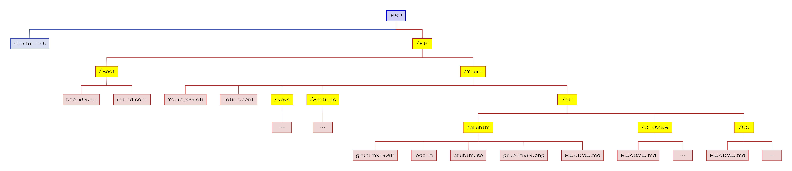
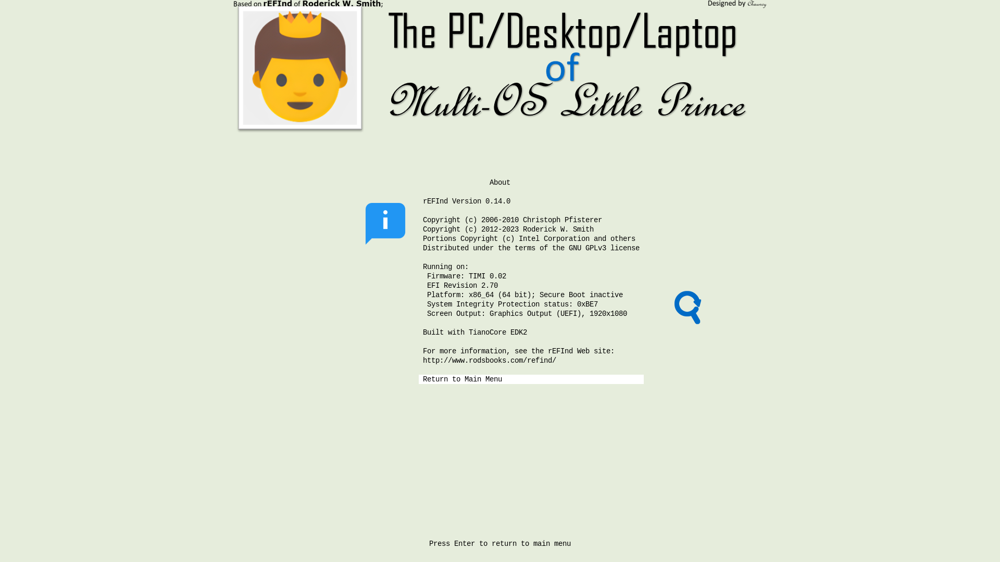

[English](README.md)|[简体中文](自述文件.md)|[繁體中文](繁體中文.md)|...
--|--|--|--

# Yours-UEFI
Y-o-u-r-s, 
Your own usual rEFInd's sign for UEFI.
#### 你的设备应该满足条件,
- 支持 64bit UEFI；
- GPU/vBIOS 支持 UEFI；
#### 工作原理
[Power On]=>[UEFI Firmware]=>[bootx64.efi]=>[Yours] 
or 
[Power On]=>[UEFI Firmware]=>[Yours_x64.efi]=>[Yours] 
#### 文件结构树状图

## 💻️预览👀

🖱️点击展开查看🖱️

## 🧭指南⬇️

### 调整 ESP 分区

🖱️点击展开查看🖱️

#### 复制到 ESP 分区
- 复制文件夹 `zip: EFI\Yours` 到 `ESP: \EFI`；
- 删除文件夹 `ESP: EFI\Boot`；
- 复制文件夹 `zip: EFI\Boot` 到 `ESP: \EFI`；
- 复制文件 `zip: startup.nsh` 到 `ESP: \`；

#### 若有 黑苹果
如果你想要，
- 让图形界面衔接得更加紧密，中途没有代码界面；
- CloverBootloader 不与 Yours 发生冲突；

你需要执行以下步骤。

🖱️点击展开查看🖱️

##### 若是 OpenCore
- 编辑 `config.plist` 设置 `LauncherOption=System` ；
- 剪切 EFI 相关文件，粘贴到 `EFI\Yours\efi\OC` ；
- 编辑 `refind.conf` ，删除 位于`include /EFI/Yours/Settings/menuentry/examples/OpenCore.conf` 前面的 `#`；

##### 若是 CloverBootloader
- 剪切 EFI 相关文件，粘贴到 `EFI\Yours\efi\CLOVER` ；
- 编辑 `refind.conf` ，删除 位于 `include /EFI/Yours/Settings/menuentry/examples/CLOVER.conf` 前面的 `#`；

### 添加入口

🖱️点击展开查看🖱️

https://www.diskgenius.com/manual/set-uefi-bios-boot-entries.php

## 📝FAQ❓️
常见问题

### 安全启动
http://www.rodsbooks.com/refind/secureboot.html

## ⭐收藏🌟
如果你喜欢并且期待未来的更新，你可以点亮星星。💫

## 🎉来源🎊
- *Roderick W. Smith* 的 [rEFInd Boot Manager](http://www.rodsbooks.com/refind/)；
- [a1ive](https://github.com/a1ive) 的 [grub2-filemanager](https://github.com/a1ive/grub2-filemanager)；

## 🧁请我吃块巧克力🍫
我没有父亲；没人给我过生日；没人为我买蛋糕🎂。 
如果你愿意，请我吃块巧克力🍫。 
我需要巧克力🍫帮助我释放内啡肽与多巴胺来缓解痛苦。 
我将会非常感谢您，仙女姐姐🧚‍ 或 玉树豪侠🦸‍♂️。 

[🧚仙女豪侠🦸‍♂️ 名单](https://github.com/M-L-P/.github/blob/main/list/README.md)